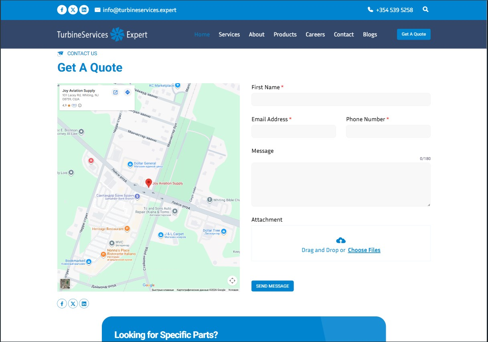
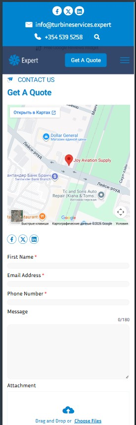

# TurbineServices — Services & Product Catalog

A responsive multi-page site: home, services, product catalog, and cart. Built from a ready-made Figma design — plain HTML, CSS, and JavaScript, no frameworks.

🔗 **Demo:** https://zhuridochka.github.io/TurbineServices-demo/cart.html#

## Screenshots

| Desktop | Mobile |
|---|---|
|  |  |

## Pages
- `index.html` — home
- `services.html` — services
- `products.html` — product catalog
- `cart.html` — cart

## Features
- Pixel-accurate layout matching the design — spacing, fonts, colors
- Responsive across desktop / tablet / mobile / mobile-small
- Contact form with email sending (`sendmail`)

## Stack
`HTML5` `CSS3` `JavaScript` · design — `Figma`
